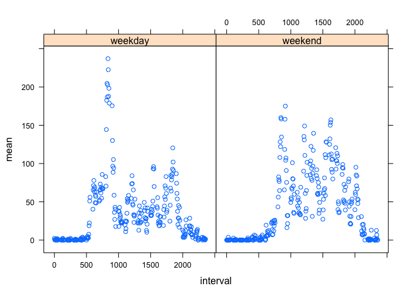

# Reproducible Research: Peer Assessment 1


## Loading and preprocessing the data


```r
library(dplyr)
activity <- read.csv("activity.csv")
```

## What is mean total number of steps taken per day?

```r
steps <- group_by(activity,date) %>% summarize(steps = sum(steps))
mean(steps$steps,na.rm=TRUE)
```

```
## [1] 10766.19
```

```r
median(steps$steps, na.rm=TRUE)
```

```
## [1] 10765
```

```r
hist(steps$steps)
```

 

## What is the average daily activity pattern?

```r
interval <- group_by(activity,interval) %>% 
    summarize(mean = mean(steps,na.rm=T))
with(interval, plot(mean~interval, type="l"))
```

 

Interval with greatest average activity is 8:35am-8:40am

```r
arrange(interval,desc(mean))[1,1]
```

```
## Source: local data frame [1 x 1]
## 
##   interval
## 1      835
```


## Imputing missing values

For each missing value I substituted the mean activity found for that interval and day of week (Sunday through Saturday). First I calculated the day of the week for each date then the mean number of steps for each interval for each day of the week:

```r
activity$day <- weekdays(as.Date(activity$date))
stepsIntDay <- group_by(activity, interval, day) %>% summarize(mean(steps, na.rm=T))
colnames(stepsIntDay) <- c("interval", "day", "mean")
```
Then I assigned the values from 'activity' to the new 'filled' data frame and filled the empty values with the expected values from the stepsIntDay data frame.


```r
filled <- activity

for (i in 1:nrow(filled)) {
    if (is.na(filled$steps[i])) { 
        filled$steps[i] = filter(stepsIntDay,day == filled$day[i] & interval == filled$interval[i])$mean}
}
```
then we can look at the new histogram and mean and median values with all missing values imputed:


```r
steps_filled <- group_by(filled,date) %>% summarize(steps =sum(steps))

hist(steps_filled$steps)
```

 

```r
mean(steps_filled$steps,na.rm=TRUE)
```

```
## [1] 10821.21
```

```r
median(steps_filled$steps,na.rm=TRUE)
```

```
## [1] 11015
```

## Are there differences in activity patterns between weekdays and weekends?

To determine if there are differences between weekdays and weekends we have to classify the two:


```r
for(i in 1:nrow(filled)) { 
    if (filled$day[i] %in% c("Saturday","Sunday")) { 
        filled$week[i] <- "weekend"} 
    else {filled$week[i] <- "weekday"}
}

intervals <- group_by(filled,interval,week) %>% 
    summarize(sum = sum(steps,na.rm=T),mean = mean(steps,na.rm=T))
```

and then plot the values:

```r
library(lattice)

with(intervals, xyplot(mean~interval|week))
```

 

There are differences between weekend and weekday activity. On the weekend activity is more consistent throughout the day as compared to weekdays. It looks as though there is a rush to get to work or perhaps a burst of activity at the gym in the morning of weekdays and less activity at work for the majority of the workday.
